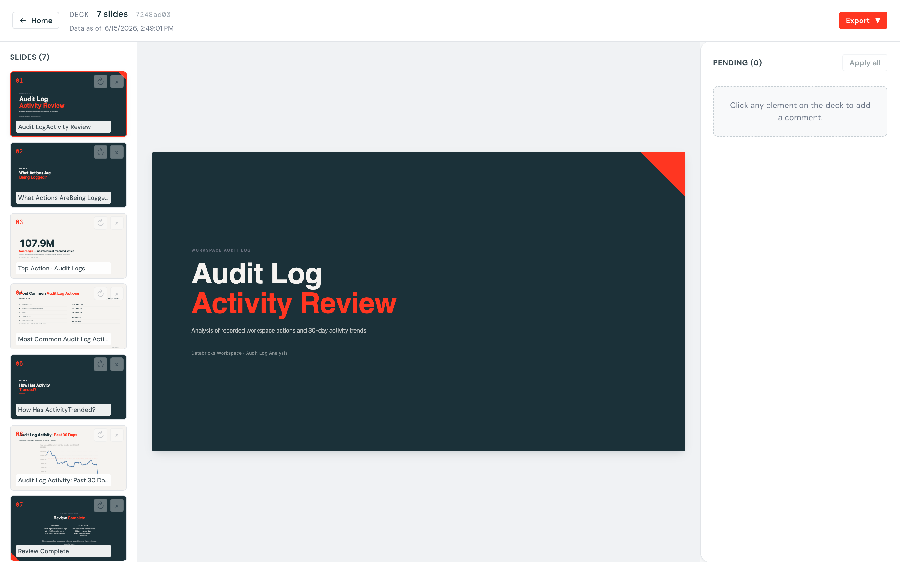
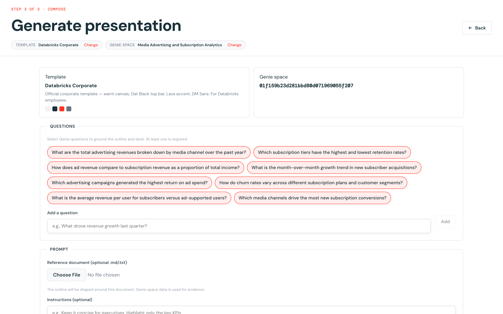

# Genie Slide

A Databricks App that turns **Genie spaces** into editable presentation decks.

Pick a brand template, pick a Genie space, choose the questions to ask — and the app
asks Genie, charts the answers, and composes a multi-slide HTML deck. Click any element
to leave a comment and the LLM rewrites just that element. Export to PPTX or Google Slides
when you're done.



> **Status:** demo. Single-user, in-memory persistence (decks reset on app restart).
> Not hardened for production.

---

## What's inside

- **Source = Genie** — pick a Genie space, then pick or write natural-language questions.
  The app asks Genie concurrently, turns each answer's result table into a chart, and
  composes the deck. (LLM-suggested questions are offered per space; you can edit/add.)
- **Generate** — Genie space + brand template → multi-slide HTML deck
  - Result tables charted server-side (Vega-Lite → PNG, embedded as ``)
  - The LLM follows a strict color/layout contract bound to the template's design tokens
- **Edit** — 3-pane editor (slide rail / canvas / pending comments); element-targeted
  LLM rewrites; real iframe thumbnails
- **Templates** — design tokens (palette, fonts, spacing) + theme markdown; 6 preset
  starters; auto-import from a Google Slides URL or a PPTX
- **Export** — PPTX (python-pptx) or Google Slides



## Architecture

```
React 19 SPA (Vite)  ──▶  FastAPI backend  ──▶  Databricks SDK
                          uvicorn + Pydantic     • Genie Conversation API (spaces, ask)
                                                 • Foundation Model API (Claude)
                          ├─ vl-convert (Vega-Lite → PNG)
                          ├─ bleach[css] sanitizer
                          └─ python-pptx
```

Genie runs on the **signed-in user's behalf** (OBO). The deck is stored as a single
`html_doc` string; each comment encodes a stable target id, and applying a comment runs a
targeted LLM rewrite of only that element.

---

## Deploy to your workspace (Databricks Asset Bundle)

### Prerequisites (to deploy)

- A Databricks workspace with **Genie spaces** and the **Foundation Model API**
  (Claude endpoints — defaults: `databricks-claude-opus-4-7`, `databricks-claude-sonnet-4-6`).
- The **Databricks CLI ≥ 0.239**, authenticated to that workspace (a configured profile:
  `databricks auth login --host https://<your-workspace>.cloud.databricks.com -p <profile>`).

That's it — the frontend is prebuilt (`frontend/dist` is committed) and the Apps runtime
installs the backend Python dependencies at deploy. **You do not need `uv` or Node just to
deploy.**

### Deploy

The bundle has no hardcoded workspace — the host comes from your CLI profile.

```bash
# 1. Deploy the bundle (creates the app + sets the OBO scopes)
databricks bundle deploy -p <profile>

# 2. Start / launch the app
databricks bundle run genie_slide -p <profile>
```

Override the app name if you like: add `--var "app_name=my-genie-slide"` to both commands.

### First run — approve the Genie scope

The app calls Genie on your behalf, so it requests the `dashboards.genie` user scope.
**On first open, approve the consent prompt.** If the "Choose a Genie space" page shows
`required scopes: genie`, the consent didn't take — re-open the app in a fresh session, or
grant it explicitly:

```bash
databricks apps update <app-name> \
  --json '{"user_api_scopes":["sql","dashboards.genie"]}' -p <profile>
```

### Use it

Open the app URL (printed by `bundle run`, or `databricks apps get <app-name>`):

1. **Pick a template** (e.g. Databricks Corporate) — or build your own / import from
   Google Slides / PPTX.
2. **Pick a Genie space.**
3. **Select or add questions** — all suggested questions are selected by default.
4. **Generate** → review the outline → **Build deck**.
5. **Edit** — click any element to comment; apply to rewrite it. **Export** to PPTX / Google Slides.

> Note: Genie execution depends on the space's data and your permissions. Questions that
> Genie can't run are skipped with a warning rather than failing the whole deck; if *every*
> question fails, pick a space whose data your principal can query.

---

## Local development (optional)

Only needed to run locally or rebuild the frontend.

```bash
# Frontend
cd frontend && npm install && npm run build      # Node ≥ 20

# Backend
cd ../backend && uv sync                          # uv
uv run uvicorn main:app --reload --port 8000
```

Open http://localhost:8000. The local server authenticates via your Databricks CLI profile.
Rebuild the whole app with `./scripts/build.sh`. Backend tests: `cd backend && uv run pytest -q`.

## Configuration

- **Serving endpoints** — edit `app.yaml` `env` (`SERVING_ENDPOINT`, `EDIT_SERVING_ENDPOINT`)
  if your workspace exposes different Claude endpoints.
- **OBO scopes** — `sql` + `dashboards.genie`, declared in both `app.yaml` and
  `resources/genie-slide.app.yml`.

## Known limitations

- **In-memory persistence** — decks and custom templates reset on app restart.
- **Google Slides export** needs Google OAuth configured on the server (works locally with
  `gcloud auth`).
- **Single user** — no multi-tenancy or rate limiting. Demo posture.

## License

Internal Databricks demo.
